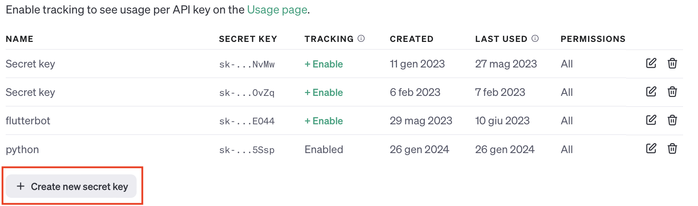

# 🤖 AmazScraper

This repo is a Python open source library for making a faster scraping using AI and without any knowledge about the HTML code.

The tech stack is fully in Python and the main libraries used are pydantic, langchain and requests. All the required libraries are in the requirements.txt file.

The use of this library allows to scrape and extract informations from websites in just few seconds instead of write ad-hoc code for each website.

This library can work passing as a parameter from the code the HTML to scrape or it can work passing the
link of the website that you want to extract informations.

# 🔍 Demo

Try out AmazScraper in your browser:

[](https://codespaces.new/VinciGit00/AmazScraper)

# 🔧 Quick Setup

Follow the following steps:

1.  ```bash
    git clone https://github.com/VinciGit00/AmazScraper.git
    ```
2.  (Optional)
    ```bash
    python -m venv venv
    source ./venv/bin/activate
    ```
3.  ```bash
    pip install -r requirements.txt
    ```
4.  Go to [https://openai.com](https://openai.com/) and login
5.  Now you can access to [https://platform.openai.com/docs/overview](https://platform.openai.com/docs/overview)
6.  Create a new API key and copy it

    

    

    

    

7.  Create a .env file inside the main and paste the API key

```config
API_KEY="your openai.com api key"
```

8. You are ready to go! 🚀
9. Try running the examples using:

```bash
python -m examples.html_scraping
```

or

```bash
python -m AmazScraper.examples.html_scraping
```

# 📖 Examples

```python
import os
from dotenv import load_dotenv
from utils.getter import scraper
from utils.class_generator import Generator

load_dotenv()

MY_ENV_VAR = os.getenv('API_KEY')

values = [
    {
        "title": "title_website",
        "type": "str",
        "description": "Give me the website name"
    }
]

if __name__ == "__main__":

    generator_instance = Generator(values, MY_ENV_VAR, 0, "gpt-3.5-turbo")

    res = generator_instance.invocation(scraper("https://www.mockupworld.co", 4197))

    print(res)
```

### Case 2: Passing your own HTML code

```python
import os
from dotenv import load_dotenv
from utils.class_generator import Generator

load_dotenv()

MY_ENV_VAR = os.getenv('API_KEY')

values = [
    {
        "title": "title",
        "type": "str",
        "description": "Title of the news"
    }
]

# Example using a HTML code
query_info = '''
        Given this code extract all the information in a json format about the news.
        <article class="c-card__wrapper aem_card_check_wrapper" data-cardindex="0">
            <div class="c-card__content">
                <h2 class="c-card__title">Booker show with 52 points, whoever has the most games over 50</h2>
                <div class="c-card__label-wrapper c-label-wrapper">
                    <span class="c-label c-label--article-heading">Standings</span>
                </div>
                <p class="c-card__abstract">The Suns' No. 1 dominated the match won in New Orleans, scoring 52 points. It's about...</p>
                <div class="c-card__info">
                    <time class="c-card__date" datetime="20 gen - 07:54">20 gen - 07:54</time>
                    <span class="c-card__content-data">
                        <i class="icon icon--media-outline icon--gallery-outline icon--xxsmall icon--c-neutral">
                            <svg width="80" height="80" viewBox="0 0 80 80" xmlns="http://www.w3.org/2000/svg" class="icon__svg icon__svg--gallery-outline">
                                <path d="M26.174 32.174v31.975h44.588V32.174H26.174zm-3.08-9.238h50.747A6.159 6.159 0 0 1 80 29.095v38.134a6.159 6.159 0 0 1-6.159 6.158H23.095a6.159 6.159 0 0 1-6.159-6.158V29.095a6.159 6.159 0 0 1 6.159-6.159zM9.239 55.665a4.619 4.619 0 0 1-9.238 0V16.777C0 10.825 4.825 6 10.777 6H64.08a4.619 4.619 0 1 1 0 9.238H10.777c-.85 0-1.54.69-1.54 1.54v38.887z" fill="currentColor" fill-rule="evenodd"></path>
                            </svg>
                        </i>
                        28 foto
                    </span>
                </div>
            </div>
            <div class="c-card__img-wrapper">
                <figure class="o-aspect-ratio o-aspect-ratio--16-10 ">
                    
                    <noscript>
                        
                    </noscript>
                </figure>
                <i class="icon icon--media icon--gallery icon--medium icon--c-primary">
                    <svg width="80" height="80" viewBox="0 0 80 80" xmlns="http://www.w3.org/2000/svg" class="icon__svg icon__svg--gallery">
                        <path d="M17.005 20.221h60.211c1.538 0 2.784 1.28 2.784 2.858v48.317c0 1.578-1.246 2.858-2.784 2.858H17.005c-1.537 0-2.784-1.28-2.784-2.858V23.079c0-1.578 1.247-2.858 2.784-2.858zM5.873 11.873V60.62a2.937 2.937 0 0 1-5.873 0V11.286A5.286 5.286 0 0 1 5.286 6h61.08a2.937 2.937 0 1 1 0 5.873H5.873z"></path>
                    </svg>
                </i>
            </div>
        </article>
    '''

if __name__ == "__main__":

    generator_instance = Generator(values, MY_ENV_VAR, 0, "gpt-3.5-turbo")

    res = generator_instance.invocation(query_info)
    print(res)
```

Note: all the model are avaiable at the following link: [https://platform.openai.com/docs/models](https://platform.openai.com/docs/models), be sure you have enabled that keys

Is it possible to run the examples through the command line inside the principal root:

For the first example:

```bash
python -m examples.value_scraping
```

For the second example:

```bash
python -m examples.html_scraping
```

# Example of output

Given the following input

```python
    [
        {
            "title": "title",
            "type": "str",
            "description": "Title of the items"
        }
    ]

```

using as a input the website [https://sport.sky.it/nba?gr=www](https://sport.sky.it/nba?gr=www)

The oputput format is a dict and its the following:

```bash
    {
    'title': 'Booker show with 52 points, whoever has the most games over 50'
    }
```

Developed by


