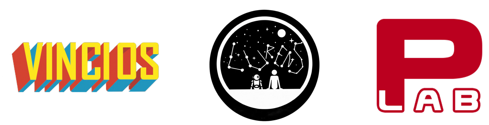

# 🕷️ ScrapeGraphAI: You Only Scrape Once

ScrapeGraphAI is a *web scraping* python library based on LangChain which uses LLM and direct graph logic to create scraping pipelines.
Just say which information you want to extract and the library will do it for you!

<p align="center">
  
</p>


## 🚀 Quick install

```bash
pip install scrapegraphai
```
## 🔍 Demo

Try out ScrapeGraphAI in your browser:

[](https://codespaces.new/VinciGit00/Scrapegraph-ai)

## 📖 Documentation

The documentation for ScrapeGraphAI can be found [here](https://scrapegraph-ai.readthedocs.io/en/latest/).

## Setup the api keys

The procedure per for activatating the openai keys are in the following link: [link](https://scrapegraph-ai.readthedocs.io/en/latest/index.html).

## 💻 Usage

### Case 1: Extracting information using a prompt

You can use the `SmartScraper` class to extract information from a website using a prompt.

The `SmartScraper` class is a direct graph implementation that uses the most common nodes present in a web scraping pipeline. For more information, please see the [documentation](https://scrapegraph-ai.readthedocs.io/en/latest/).

```python
from scrapegraphai.graphs import SmartScraper

OPENAI_API_KEY = "YOUR_API_KEY"

llm_config = {
    "api_key": OPENAI_API_KEY,
    "model_name": "gpt-3.5-turbo",
}

smart_scraper = SmartScraper("List me all the titles and project descriptions",
                             "https://perinim.github.io/projects/", llm_config)

answer = smart_scraper.run()
print(answer)
```

The output will be a dictionary with the extracted information, for example:

```bash
{
    'titles': [
        'Rotary Pendulum RL'
        ],
    'descriptions': [
        'Open Source project aimed at controlling a real life rotary pendulum using RL algorithms'
        ]
}
```

## 🤝 Contributing

Contributions are welcome! Please check out the todos below, and feel free to open a pull request.
For more information, please see the [contributing guidelines](CONTRIBUTING.md).

After installing and activating the virtual environment, please remember to install the library using the "dev" extra parameter to have the extra dependencies for development.

```bash
pip install -e .[dev]
```

## Contributors

[](https://github.com/VinciGit00/Scrapegraph-ai/graphs/contributors)

## Authors

<p align="center">
  
</p>

## 📜 License

ScrapeGraphAI is licensed under the Apache 2.0 License. See the [LICENSE](LICENSE) file for more information.

## Acknowledgements

- We would like to thank all the contributors to the project and the open-source community for their support.
- ScrapeGraphAI is meant to be used for data exploration and research purposes only. We are not responsible for any misuse of the library.

## Thanks to: 
- [nicolapiazzalunga](https://github.com/nicolapiazzalunga) for having inspired us to the functions: scrapegraph/convert_to_json.py and scrapegraph/convert_to_csv.py
