# 🕷️ ScrapeGraphAI: You Only Scrape Once
[English](https://github.com/VinciGit00/Scrapegraph-ai/blob/main/README.md) | [中文](https://github.com/VinciGit00/Scrapegraph-ai/blob/main/docs/chinese.md) | [日本語](https://github.com/VinciGit00/Scrapegraph-ai/blob/main/docs/japanese.md)
| [한국어](https://github.com/VinciGit00/Scrapegraph-ai/blob/main/docs/korean.md)
| [Русский](https://github.com/VinciGit00/Scrapegraph-ai/blob/main/docs/russian.md)


[](https://pepy.tech/project/scrapegraphai)
[](https://github.com/pylint-dev/pylint)
[](https://github.com/VinciGit00/Scrapegraph-ai/actions/workflows/pylint.yml)
[](https://github.com/VinciGit00/Scrapegraph-ai/actions/workflows/codeql.yml)
[](https://opensource.org/licenses/MIT)
[](https://discord.gg/gkxQDAjfeX)

ScrapeGraphAI is a *web scraping* python library that uses LLM and direct graph logic to create scraping pipelines for websites and local documents (XML, HTML, JSON, Markdown, etc.).

Just say which information you want to extract and the library will do it for you!

<p align="center">
  
</p>

## 🚀 Quick install

The reference page for Scrapegraph-ai is available on the official page of PyPI: [pypi](https://pypi.org/project/scrapegraphai/).

```bash
pip install scrapegraphai

playwright install
```

**Note**: it is recommended to install the library in a virtual environment to avoid conflicts with other libraries 🐱

By the way if you to use not mandatory modules it is necessary to install by yourself with the following command:

### Installing "Other Language Models"

This group allows you to use additional language models like Fireworks, Groq, Anthropic, Hugging Face, and Nvidia AI Endpoints.
```bash
pip install scrapegraphai[other-language-models]

```
### Installing "More Semantic Options"

This group includes tools for advanced semantic processing, such as Graphviz.
```bash
pip install scrapegraphai[more-semantic-options]
```
### Installing "More Browser Options"

This group includes additional browser management options, such as BrowserBase.
```bash
pip install scrapegraphai[more-browser-options]
```

## 💻 Usage
There are multiple standard scraping pipelines that can be used to extract information from a website (or local file).

The most common one is the `SmartScraperGraph`, which extracts information from a single page given a user prompt and a source URL.


```python
import json
from scrapegraphai.graphs import SmartScraperGraph

# Define the configuration for the scraping pipeline
graph_config = {
    "llm": {
        "api_key": "YOUR_OPENAI_APIKEY",
        "model": "openai/gpt-4o-mini",
    },
    "verbose": True,
    "headless": False,
}

# Create the SmartScraperGraph instance
smart_scraper_graph = SmartScraperGraph(
    prompt="Find some information about what does the company do, the name and a contact email.",
    source="https://scrapegraphai.com/",
    config=graph_config
)

# Run the pipeline
result = smart_scraper_graph.run()
print(json.dumps(result, indent=4))
```

The output will be a dictionary like the following:

```python
{
    "company": "ScrapeGraphAI",
    "name": "ScrapeGraphAI Extracting content from websites and local documents using LLM",
    "contact_email": "contact@scrapegraphai.com"
}
```

There are other pipelines that can be used to extract information from multiple pages, generate Python scripts, or even generate audio files.

| Pipeline Name           | Description                                                                                                      |
|-------------------------|------------------------------------------------------------------------------------------------------------------|
| SmartScraperGraph       | Single-page scraper that only needs a user prompt and an input source.                                           |
| SearchGraph             | Multi-page scraper that extracts information from the top n search results of a search engine.                  |
| SpeechGraph             | Single-page scraper that extracts information from a website and generates an audio file.                       |
| ScriptCreatorGraph      | Single-page scraper that extracts information from a website and generates a Python script.                     |
| SmartScraperMultiGraph  | Multi-page scraper that extracts information from multiple pages given a single prompt and a list of sources.    |
| ScriptCreatorMultiGraph | Multi-page scraper that generates a Python script for extracting information from multiple pages and sources.     |

It is possible to use different LLM through APIs, such as **OpenAI**, **Groq**, **Azure** and **Gemini**, or local models using **Ollama**.

Remember to have [Ollama](https://ollama.com/) installed and download the models using the **ollama pull** command, if you want to use local models.

## 🔍 Demo
Official streamlit demo:

[](https://scrapegraph-ai-web-dashboard.streamlit.app)

Try it directly on the web using Google Colab:

[](https://colab.research.google.com/drive/1sEZBonBMGP44CtO6GQTwAlL0BGJXjtfd?usp=sharing)

## 📖 Documentation

The documentation for ScrapeGraphAI can be found [here](https://scrapegraph-ai.readthedocs.io/en/latest/).

Check out also the Docusaurus [here](https://scrapegraph-doc.onrender.com/).

## 🏆 Sponsors
<div style="text-align: center;">
  <a href="https://2ly.link/1zNiz">
    
  </a>
  <a href="https://2ly.link/1zNj1">
    
  </a>
</div>

## 🤝 Contributing

Feel free to contribute and join our Discord server to discuss with us improvements and give us suggestions!

Please see the [contributing guidelines](https://github.com/VinciGit00/Scrapegraph-ai/blob/main/CONTRIBUTING.md).

[](https://discord.gg/uJN7TYcpNa)
[](https://www.linkedin.com/company/scrapegraphai/)
[](https://twitter.com/scrapegraphai)

## 📈 Roadmap

We are working on the following features! If you are interested in collaborating right-click on the feature and open in a new tab to file a PR. If you have doubts and wanna discuss them with us, just contact us on [discord](https://discord.gg/uJN7TYcpNa) or open a [Discussion](https://github.com/VinciGit00/Scrapegraph-ai/discussions) here on Github!

```mermaid
%%{init: {'theme': 'base', 'themeVariables': { 'primaryColor': '#5C4B9B', 'edgeLabelBackground':'#ffffff', 'tertiaryColor': '#ffffff', 'primaryBorderColor': '#5C4B9B', 'fontFamily': 'Arial', 'fontSize': '16px', 'textColor': '#5C4B9B' }}}%%
graph LR
    A[DeepSearch Graph] --> F[Use Existing Chromium Instances]
    F --> B[Page Caching]
    B --> C[Screenshot Scraping]
    C --> D[Handle Dynamic Content]
    D --> E[New Webdrivers]

    style A fill:#ffffff,stroke:#5C4B9B,stroke-width:2px,rx:10,ry:10
    style F fill:#ffffff,stroke:#5C4B9B,stroke-width:2px,rx:10,ry:10
    style B fill:#ffffff,stroke:#5C4B9B,stroke-width:2px,rx:10,ry:10
    style C fill:#ffffff,stroke:#5C4B9B,stroke-width:2px,rx:10,ry:10
    style D fill:#ffffff,stroke:#5C4B9B,stroke-width:2px,rx:10,ry:10
    style E fill:#ffffff,stroke:#5C4B9B,stroke-width:2px,rx:10,ry:10

    click A href "https://github.com/VinciGit00/Scrapegraph-ai/issues/260" "Open DeepSearch Graph Issue"
    click F href "https://github.com/VinciGit00/Scrapegraph-ai/issues/329" "Open Chromium Instances Issue"
    click B href "https://github.com/VinciGit00/Scrapegraph-ai/issues/197" "Open Page Caching Issue"
    click C href "https://github.com/VinciGit00/Scrapegraph-ai/issues/197" "Open Screenshot Scraping Issue"
    click D href "https://github.com/VinciGit00/Scrapegraph-ai/issues/279" "Open Handle Dynamic Content Issue"
    click E href "https://github.com/VinciGit00/Scrapegraph-ai/issues/171" "Open New Webdrivers Issue"
```



## ❤️ Contributors
[](https://github.com/VinciGit00/Scrapegraph-ai/graphs/contributors)

## 🎓 Citations
If you have used our library for research purposes please quote us with the following reference:
```text
  @misc{scrapegraph-ai,
    author = {Marco Perini, Lorenzo Padoan, Marco Vinciguerra},
    title = {Scrapegraph-ai},
    year = {2024},
    url = {https://github.com/VinciGit00/Scrapegraph-ai},
    note = {A Python library for scraping leveraging large language models}
  }
```

## Authors

<p align="center">
  
</p>

|                    | Contact Info         |
|--------------------|----------------------|
| Marco Vinciguerra  | [](https://www.linkedin.com/in/marco-vinciguerra-7ba365242/)    |
| Marco Perini       | [](https://www.linkedin.com/in/perinim/)   |
| Lorenzo Padoan     | [](https://www.linkedin.com/in/lorenzo-padoan-4521a2154/)  |

## 📜 License

ScrapeGraphAI is licensed under the MIT License. See the [LICENSE](https://github.com/VinciGit00/Scrapegraph-ai/blob/main/LICENSE) file for more information.

## Acknowledgements

- We would like to thank all the contributors to the project and the open-source community for their support.
- ScrapeGraphAI is meant to be used for data exploration and research purposes only. We are not responsible for any misuse of the library.
