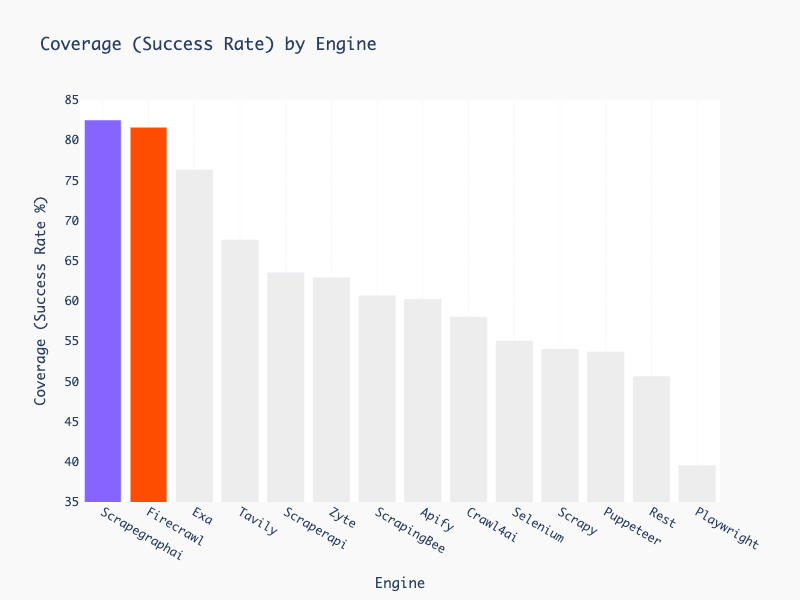

## 🚀 **さらに高速でシンプルな大規模スクレイピング方法（わずか5行のコード）をお探しですか？** [**ScrapeGraphAI.com**](https://scrapegraphai.com/?utm_source=github&utm_medium=readme&utm_campaign=oss_cta&utm_content=top_banner) の拡張版をご覧ください！🚀

---

# 🕷️ ScrapeGraphAI: 一度のクロールで完結

[English](https://github.com/VinciGit00/Scrapegraph-ai/blob/main/README.md) | [中文](https://github.com/VinciGit00/Scrapegraph-ai/blob/main/docs/chinese.md) | [日本語](https://github.com/VinciGit00/Scrapegraph-ai/blob/main/docs/japanese.md)
| [한국어](https://github.com/VinciGit00/Scrapegraph-ai/blob/main/docs/korean.md)
| [Русский](https://github.com/VinciGit00/Scrapegraph-ai/blob/main/docs/russian.md) | [Türkçe](https://github.com/VinciGit00/Scrapegraph-ai/blob/main/docs/turkish.md)
| [Deutsch](https://www.readme-i18n.com/ScrapeGraphAI/Scrapegraph-ai?lang=de)
| [Español](https://www.readme-i18n.com/ScrapeGraphAI/Scrapegraph-ai?lang=es)
| [français](https://www.readme-i18n.com/ScrapeGraphAI/Scrapegraph-ai?lang=fr)
| [Português](https://github.com/VinciGit00/Scrapegraph-ai/blob/main/docs/portuguese.md)

[](https://pepy.tech/projects/scrapegraphai)
[](https://github.com/pylint-dev/pylint)
[](https://github.com/VinciGit00/Scrapegraph-ai/actions/workflows/code-quality.yml)
[](https://github.com/VinciGit00/Scrapegraph-ai/actions/workflows/codeql.yml)
[](https://opensource.org/licenses/MIT)
[](https://discord.gg/gkxQDAjfeX)

[](https://scrapegraphai.com/?utm_source=github&utm_medium=readme&utm_campaign=api_banner&utm_content=api_banner_image)

<p align="center">
<a href="https://trendshift.io/repositories/9761" target="_blank"></a>
<p align="center">

ScrapeGraphAIは、大規模言語モデルと直接グラフロジックを使用して、ウェブサイトやローカルドキュメント（XML、HTML、JSON、Markdownなど）のクローリングパイプラインを作成するPythonライブラリです。

クロールしたい情報をライブラリに伝えるだけで、残りはすべてライブラリが行います！

<p align="center">
  
</p>


## 🚀 統合
ScrapeGraphAIは、人気のあるフレームワークやツールとのシームレスな統合を提供し、スクレイピング機能を強化します。PythonまたはNode.jsで構築する場合でも、LLMフレームワークを使用する場合でも、ノーコードプラットフォームで作業する場合でも、包括的な統合オプションを提供しています。

詳細情報は以下の[リンク](https://scrapegraphai.com)で確認できます

**統合**：
- **API**: [ドキュメント](https://docs.scrapegraphai.com/introduction)
- **SDKs**: [Python](https://docs.scrapegraphai.com/sdks/python), [Node](https://docs.scrapegraphai.com/sdks/javascript)
- **LLMフレームワーク**: [Langchain](https://docs.scrapegraphai.com/integrations/langchain), [Llama Index](https://docs.scrapegraphai.com/integrations/llamaindex), [Crew.ai](https://docs.scrapegraphai.com/integrations/crewai), [Agno](https://docs.scrapegraphai.com/integrations/agno), [CamelAI](https://github.com/camel-ai/camel)
- **ローコードフレームワーク**: [Pipedream](https://pipedream.com/apps/scrapegraphai), [Bubble](https://bubble.io/plugin/scrapegraphai-1745408893195x213542371433906180), [Zapier](https://zapier.com/apps/scrapegraphai/integrations), [n8n](http://localhost:5001/dashboard), [Dify](https://dify.ai), [Toolhouse](https://app.toolhouse.ai/mcp-servers/scrapegraph_smartscraper)
- **MCPサーバー**:  [リンク](https://smithery.ai/server/@ScrapeGraphAI/scrapegraph-mcp)

## 🚀 クイックインストール

Scrapegraph-aiの参照ページはPyPIの公式サイトで見ることができます: [pypi](https://pypi.org/project/scrapegraphai/)。

```bash
pip install scrapegraphai

# 重要（ウェブサイトコンテンツの取得用）
playwright install
```

**注意**: 他のライブラリとの競合を避けるため、このライブラリは仮想環境でのインストールを推奨します 🐱


## 💻 使い方
ウェブサイト（またはローカルファイル）から情報を抽出するために使用できる複数の標準スクレイピングパイプラインがあります。

最も一般的なのは `SmartScraperGraph` で、ユーザープロンプトとソースURLが与えられた場合に単一ページから情報を抽出します。


```python
from scrapegraphai.graphs import SmartScraperGraph

# スクレイピングパイプラインの設定を定義
graph_config = {
    "llm": {
        "model": "ollama/llama3.2",
        "model_tokens": 8192,
        "format": "json",
    },
    "verbose": True,
    "headless": False,
}

# SmartScraperGraphインスタンスを作成
smart_scraper_graph = SmartScraperGraph(
    prompt="ウェブページから有用な情報を抽出してください。会社の説明、創設者、ソーシャルメディアリンクを含めてください",
    source="https://scrapegraphai.com/",
    config=graph_config
)

# パイプラインを実行
result = smart_scraper_graph.run()

import json
print(json.dumps(result, indent=4))
```

> [!NOTE]
> OpenAIやその他のモデルの場合は、llm設定を変更するだけです！
> ```python
>graph_config = {
>    "llm": {
>        "api_key": "YOUR_OPENAI_API_KEY",
>        "model": "openai/gpt-4o-mini",
>    },
>    "verbose": True,
>    "headless": False,
>}
>```


出力は次のような辞書になります：

```python
{
    "description": "ScrapeGraphAI transforms websites into clean, organized data for AI agents and data analytics. It offers an AI-powered API for effortless and cost-effective data extraction.",
    "founders": [
        {
            "name": "",
            "role": "Founder & Technical Lead",
            "linkedin": "https://www.linkedin.com/in/perinim/"
        },
        {
            "name": "Marco Vinciguerra",
            "role": "Founder & Software Engineer",
            "linkedin": "https://www.linkedin.com/in/marco-vinciguerra-7ba365242/"
        },
        {
            "name": "Lorenzo Padoan",
            "role": "Founder & Product Engineer",
            "linkedin": "https://www.linkedin.com/in/lorenzo-padoan-4521a2154/"
        }
    ],
    "social_media_links": {
        "linkedin": "https://www.linkedin.com/company/101881123",
        "twitter": "https://x.com/scrapegraphai",
        "github": "https://github.com/ScrapeGraphAI/Scrapegraph-ai"
    }
}
```
複数のページから情報を抽出したり、Pythonスクリプトを生成したり、さらにはオーディオファイルを生成したりするために使用できる他のパイプラインもあります。

| パイプライン名           | 説明                                                                                                      |
|-------------------------|------------------------------------------------------------------------------------------------------------------|
| SmartScraperGraph       | ユーザープロンプトと入力ソースのみが必要な単一ページスクレイパー。                                           |
| SearchGraph             | 検索エンジンの上位n個の検索結果から情報を抽出する複数ページスクレイパー。                  |
| SpeechGraph             | ウェブサイトから情報を抽出し、オーディオファイルを生成する単一ページスクレイパー。                       |
| ScriptCreatorGraph      | ウェブサイトから情報を抽出し、Pythonスクリプトを生成する単一ページスクレイパー。                     |
| SmartScraperMultiGraph  | 単一のプロンプトとソースのリストが与えられた場合に複数のページから情報を抽出する複数ページスクレイパー。    |
| ScriptCreatorMultiGraph | 複数のページとソースから情報を抽出するためのPythonスクリプトを生成する複数ページスクレイパー。     |

これらのグラフのそれぞれには、マルチバージョンがあります。これにより、LLMの呼び出しを並列で行うことができます。

**OpenAI**、**Groq**、**Azure**、**Gemini**などのAPIを介して、または**Ollama**を使用してローカルモデルを使用して、異なるLLMを使用することができます。

ローカルモデルを使用する場合は、[Ollama](https://ollama.com/)がインストールされていること、および**ollama pull**コマンドを使用してモデルをダウンロードしていることを確認してください。


## 📖 ドキュメント

[](https://colab.research.google.com/drive/1sEZBonBMGP44CtO6GQTwAlL0BGJXjtfd?usp=sharing)

ScrapeGraphAIのドキュメントは[こちら](https://scrapegraph-ai.readthedocs.io/en/latest/)で見ることができます。
Docusaurusの[バージョン](https://docs-oss.scrapegraphai.com/)もご覧ください。

## 🤝 貢献

貢献を歓迎し、Discordサーバーで改善や提案について話し合います！

[貢献ガイド](https://github.com/VinciGit00/Scrapegraph-ai/blob/main/CONTRIBUTING.md)をご覧ください。

[](https://discord.gg/uJN7TYcpNa)
[](https://www.linkedin.com/company/scrapegraphai/)
[](https://twitter.com/scrapegraphai)

## 🔗 ScrapeGraph API & SDKs
システムにScrapeGraphを統合するための迅速なソリューションをお探しの場合は、強力なAPIを[こちら！](https://dashboard.scrapegraphai.com/login)でご確認ください。

[](https://dashboard.scrapegraphai.com/login)

PythonとNode.jsの両方でSDKを提供しており、プロジェクトに簡単に統合できます。以下をご覧ください：

| SDK       | 言語 | GitHubリンク                                                                 |
|-----------|----------|-----------------------------------------------------------------------------|
| Python SDK | Python   | [scrapegraph-py](https://github.com/ScrapeGraphAI/scrapegraph-sdk/tree/main/scrapegraph-py) |
| Node.js SDK | Node.js  | [scrapegraph-js](https://github.com/ScrapeGraphAI/scrapegraph-sdk/tree/main/scrapegraph-js) |

公式APIドキュメントは[こちら](https://docs.scrapegraphai.com/)で見ることができます。

## 🔥 ベンチマーク

Firecrawlベンチマーク [Firecrawl benchmark](https://github.com/firecrawl/scrape-evals/pull/3)によると、ScrapeGraphは市場で最高のフェッチャーです！



## 📈 テレメトリ
パッケージの品質とユーザーエクスペリエンスを向上させるために、匿名の使用メトリクスを収集しています。このデータは、改善の優先順位付けと互換性の確保に役立ちます。オプトアウトする場合は、環境変数SCRAPEGRAPHAI_TELEMETRY_ENABLED=falseを設定してください。詳細については、[こちら](https://scrapegraph-ai.readthedocs.io/en/latest/scrapers/telemetry.html)のドキュメントを参照してください。

## ❤️ 貢献者
[](https://github.com/VinciGit00/Scrapegraph-ai/graphs/contributors)

## 🎓 引用
研究目的で当社のライブラリを使用する場合は、以下の参考文献を引用してください：
```text
  @misc{scrapegraph-ai,
    author = {Lorenzo Padoan, Marco Vinciguerra},
    title = {Scrapegraph-ai},
    year = {2024},
    url = {https://github.com/VinciGit00/Scrapegraph-ai},
    note = {大規模言語モデルを活用したスクレイピング用のPythonライブラリ}
  }
```
## 作者

|                    | 連絡先         |
|--------------------|----------------------|
| Marco Vinciguerra  | [](https://www.linkedin.com/in/marco-vinciguerra-7ba365242/)    |
| Lorenzo Padoan     | [](https://www.linkedin.com/in/lorenzo-padoan-4521a2154/)  |

## 📜 ライセンス

ScrapeGraphAIはMITライセンスの下で提供されています。詳細は[LICENSE](https://github.com/VinciGit00/Scrapegraph-ai/blob/main/LICENSE)ファイルをご覧ください。

## 謝辞

- プロジェクトの貢献者とオープンソースコミュニティのサポートに感謝します。
- ScrapeGraphAIはデータ探索と研究目的のみに使用されます。このライブラリの不正使用については一切責任を負いません。

Made with ❤️ by [ScrapeGraph AI](https://scrapegraphai.com)

[Scarf tracking](https://static.scarf.sh/a.png?x-pxid=102d4b8c-cd6a-4b9e-9a16-d6d141b9212d)
