```mermaid
%%{init: {'theme': 'base', 'themeVariables': { 'primaryColor': '#5C4B9B', 'edgeLabelBackground':'#ffffff', 'tertiaryColor': '#ffffff', 'primaryBorderColor': '#5C4B9B', 'fontFamily': 'Arial', 'fontSize': '16px', 'textColor': '#5C4B9B' }}}%%
graph LR
    A[DeepSearch Graph] --> F[Use Existing Chromium Instances]
    F --> B[Page Caching]
    B --> C[Screenshot Scraping]
    C --> D[Handle Dynamic Content]
    D --> E[New Webdrivers]

    style A fill:#ffffff,stroke:#5C4B9B,stroke-width:2px,rx:10,ry:10
    style F fill:#ffffff,stroke:#5C4B9B,stroke-width:2px,rx:10,ry:10
    style B fill:#ffffff,stroke:#5C4B9B,stroke-width:2px,rx:10,ry:10
    style C fill:#ffffff,stroke:#5C4B9B,stroke-width:2px,rx:10,ry:10
    style D fill:#ffffff,stroke:#5C4B9B,stroke-width:2px,rx:10,ry:10
    style E fill:#ffffff,stroke:#5C4B9B,stroke-width:2px,rx:10,ry:10

    click A href "https://github.com/VinciGit00/Scrapegraph-ai/issues/260" "Open DeepSearch Graph Issue"
    click F href "https://github.com/VinciGit00/Scrapegraph-ai/issues/329" "Open Chromium Instances Issue"
    click B href "https://github.com/VinciGit00/Scrapegraph-ai/issues/197" "Open Page Caching Issue"
    click C href "https://github.com/VinciGit00/Scrapegraph-ai/issues/197" "Open Screenshot Scraping Issue"
    click D href "https://github.com/VinciGit00/Scrapegraph-ai/issues/279" "Open Handle Dynamic Content Issue"
    click E href "https://github.com/VinciGit00/Scrapegraph-ai/issues/171" "Open New Webdrivers Issue"
```

# 🕷️ ScrapeGraphAI: 한 방에 끝내는 웹스크래핑


ScrapeGraphAI는 웹 사이트와 로컬 문서(XML, HTML, JSON 등)에 대한 스크래핑 파이프라인을 만들기 위해 LLM 및 직접 그래프 로직을 사용하는 파이썬 웹스크래핑 라이브러리입니다.

추출하려는 정보를 말하기만 하면 라이브러리가 알아서 처리해 줍니다!

<p align="center">
  
</p>

## 🚀 빠른 설치

Scrapegraph-ai에 대한 참조 페이지는 PyPI의 공식 페이지에서 확인할 수 있습니다: [pypi](https://pypi.org/project/scrapegraphai/).

```bash
pip install scrapegraphai
```
참고: 다른 라이브러리와의 충돌을 피하기 위해 라이브러리를 가상 환경에 설치하는 것이 좋습니다 🐱

## 🔍 데모

공식 Streamlit 데모:

[](https://scrapegraph-ai-web-dashboard.streamlit.app)


Google Colab을 사용하여 웹에서 직접 사용해 보세요:

[](https://colab.research.google.com/drive/1sEZBonBMGP44CtO6GQTwAlL0BGJXjtfd?usp=sharing)


## 📖 문서

ScrapeGraphAI에 대한 문서는 [여기](https://scrapegraph-ai.readthedocs.io/en/latest/)에서 찾을 수 있습니다.

또한 Docusaurus를 [여기](https://scrapegraph-doc.onrender.com/)에서 확인해 보세요.

## 💻 사용법

웹사이트(또는 로컬 파일)에서 정보를 추출하기 위해 사용할 수 있는 여러 표준 스크래핑 파이프라인이 있습니다:
- `SmartScraperGraph`: 사용자 프롬프트와 입력 소스만 필요로 하는 단일 페이지 스크래퍼입니다.
- `SearchGraph`: 검색 엔진의 상위 n개 검색 결과에서 정보를 추출하는 다중 페이지 스크래퍼입니다.
- `SpeechGraph`: 웹사이트에서 정보를 추출하고 오디오 파일을 생성하는 단일 페이지 스크래퍼입니다.
- `ScriptCreatorGraph`: 웹사이트에서 정보를 추출하고 Python 스크립트를 생성하는 단일 페이지 스크래퍼입니다.

- `SmartScraperMultiGraph`: 단일 프롬프트와 소스 목록을 사용하여 여러 페이지에서 정보를 추출하는 다중 페이지 스크래퍼입니다.
- `ScriptCreatorMultiGraph`: 단일 프롬프트와 소스 목록을 사용하여 여러 페이지에서 정보를 추출하는 Python 스크립트를 생성하는 다중 페이지 스크래퍼입니다.

**OpenAI**, **Groq**, **Azure**, **Gemini**와 같은 API를 통해 다양한 LLM을 사용할 수 있으며, **Ollama**를 사용하여 로컬 모델도 사용할 수 있습니다.

### 사례 1: 로컬 모델을 사용하는 SmartScraper
[Ollama](https://ollama.com/)를 설치하고  **ollama pull** 명령을 사용하여 모델을 다운로드하세요.

```python
from scrapegraphai.graphs import SmartScraperGraph

graph_config = {
    "llm": {
        "model": "ollama/mistral",
        "temperature": 0,
        "format": "json",  # Ollama needs the format to be specified explicitly
        "base_url": "http://localhost:11434", # set Ollama URL
    },
    "embeddings": {
        "model": "ollama/nomic-embed-text",
        "base_url": "http://localhost:11434",  # set Ollama URL
    },
    "verbose": True,
}

smart_scraper_graph = SmartScraperGraph(
    prompt="List me all the projects with their descriptions",
    # also accepts a string with the already downloaded HTML code
    source="https://perinim.github.io/projects",
    config=graph_config
)

result = smart_scraper_graph.run()
print(result)
```

출력은 다음과 같이 프로젝트와 설명의 목록이 될 것입니다:

```python
{'projects': [{'title': 'Rotary Pendulum RL', 'description': 'Open Source project aimed at controlling a real life rotary pendulum using RL algorithms'}, {'title': 'DQN Implementation from scratch', 'description': 'Developed a Deep Q-Network algorithm to train a simple and double pendulum'}, ...]}
```

### 사례 2: 혼합 모델을 사용하는 SearchGraph
우리는 LLM에 **Groq**를 사용하고, 임베딩에 **Ollama**를 사용합니다.

```python
from scrapegraphai.graphs import SearchGraph

# Define the configuration for the graph
graph_config = {
    "llm": {
        "model": "groq/gemma-7b-it",
        "api_key": "GROQ_API_KEY",
        "temperature": 0
    },
    "embeddings": {
        "model": "ollama/nomic-embed-text",
        "base_url": "http://localhost:11434",  # set ollama URL arbitrarily
    },
    "max_results": 5,
}

# Create the SearchGraph instance
search_graph = SearchGraph(
    prompt="List me all the traditional recipes from Chioggia",
    config=graph_config
)

# Run the graph
result = search_graph.run()
print(result)
```

출력은 다음과 같이 레시피 목록이 될 것입니다:

```python
{'recipes': [{'name': 'Sarde in Saòre'}, {'name': 'Bigoli in salsa'}, {'name': 'Seppie in umido'}, {'name': 'Moleche frite'}, {'name': 'Risotto alla pescatora'}, {'name': 'Broeto'}, {'name': 'Bibarasse in Cassopipa'}, {'name': 'Risi e bisi'}, {'name': 'Smegiassa Ciosota'}]}
```
### 사례 3: OpenAI를 사용하는 SpeechGraph

OpenAI API 키와 모델 이름만 전달하면 됩니다.

```python
from scrapegraphai.graphs import SpeechGraph

graph_config = {
    "llm": {
        "api_key": "OPENAI_API_KEY",
        "model": "openai/gpt-3.5-turbo",
    },
    "tts_model": {
        "api_key": "OPENAI_API_KEY",
        "model": "tts-1",
        "voice": "alloy"
    },
    "output_path": "audio_summary.mp3",
}

# ************************************************
# Create the SpeechGraph instance and run it
# ************************************************

speech_graph = SpeechGraph(
    prompt="Make a detailed audio summary of the projects.",
    source="https://perinim.github.io/projects/",
    config=graph_config,
)

result = speech_graph.run()
print(result)

```

출력은 페이지의 프로젝트 요약이 포함된 오디오 파일이 될 것입니다.

## 스폰

<div style="text-align: center;">
  <a href="https://serpapi.com?utm_source=scrapegraphai">
    
  </a>
  <a href="https://dashboard.statproxies.com/?refferal=scrapegraph">
    
  </a>
</div>

## 🤝 기여

기여를 환영하며, 개선 사항을 논의하고 제안 사항을 주고받기 위해 우리의 Discord 서버에 참여하세요!

기여 가이드라인을 참고해주세요: [contributing guidelines](https://github.com/VinciGit00/Scrapegraph-ai/blob/main/CONTRIBUTING.md).

## 📈 로드맵

다음 기능들을 작업하고 있습니다! 협업에 관심이 있으시면 해당 기능을 마우스 오른쪽 버튼으로 클릭하여 새 탭에서 PR을 작성해주세요. 의문사항이 있거나 논의하고 싶다면 [Discord](https://discord.gg/uJN7TYcpNa)에서 저희에게 연락하거나 Github의 [Discussion](https://github.com/VinciGit00/Scrapegraph-ai/discussions) 페이지를 열어주세요!



## ️ 기여자들
[](https://github.com/VinciGit00/Scrapegraph-ai/graphs/contributors)

## 🎓 인용
우리의 라이브러리를 연구 목적으로 사용한 경우 다음과 같이 인용해 주세요:
```text
  @misc{scrapegraph-ai,
    author = {Marco Perini, Lorenzo Padoan, Marco Vinciguerra},
    title = {Scrapegraph-ai},
    year = {2024},
    url = {https://github.com/VinciGit00/Scrapegraph-ai},
    note = {A Python library for scraping leveraging large language models}
  }
```

## 저자들

<p align="center">
  
</p>

|                    | 연락처        |
|--------------------|---------------|
| Marco Vinciguerra  | [](https://www.linkedin.com/in/marco-vinciguerra-7ba365242/)    |
| Marco Perini       | [](https://www.linkedin.com/in/perinim/)   |
| Lorenzo Padoan     | [](https://www.linkedin.com/in/lorenzo-padoan-4521a2154/)  |

## 📜 라이선스

ScrapeGraphAI는 MIT License로 배포되었습니. 자세한 내용은 [LICENSE](https://github.com/VinciGit00/Scrapegraph-ai/blob/main/LICENSE) 파일을 참조하세요.

## 감사의 말

- 프로젝트에 기여한 모든 분들과 오픈 소스 커뮤니티에 감사드립니다.
- ScrapeGraphAI는 데이터 탐색 및 연구 목적으로만 사용되어야 합니다. 우리는 라이브러리의 오용에 대해 책임을 지지 않습니다.
