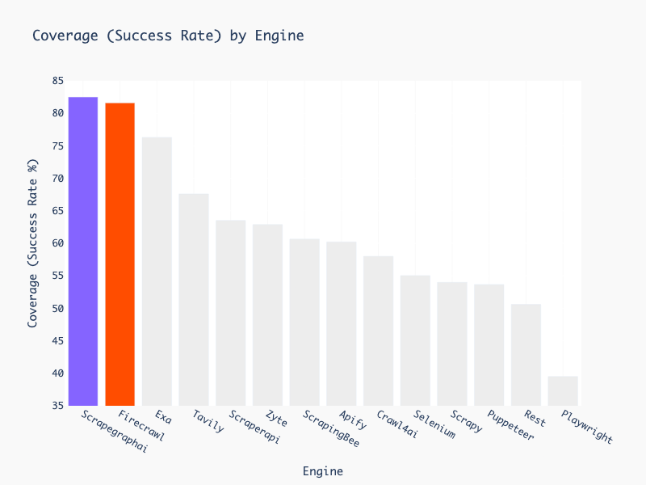

## 🚀 **Ищете еще более быстрый и простой способ масштабного скрейпинга (всего 5 строк кода)?** Ознакомьтесь с нашей улучшенной версией на [**ScrapeGraphAI.com**](https://scrapegraphai.com/?utm_source=github&utm_medium=readme&utm_campaign=oss_cta&utm_content=top_banner)! 🚀

---

# 🕷️ ScrapeGraphAI: Вы скрейпите только один раз

[English](https://github.com/VinciGit00/Scrapegraph-ai/blob/main/README.md) | [中文](https://github.com/VinciGit00/Scrapegraph-ai/blob/main/docs/chinese.md) | [日本語](https://github.com/VinciGit00/Scrapegraph-ai/blob/main/docs/japanese.md)
| [한국어](https://github.com/VinciGit00/Scrapegraph-ai/blob/main/docs/korean.md)
| [Русский](https://github.com/VinciGit00/Scrapegraph-ai/blob/main/docs/russian.md) | [Türkçe](https://github.com/VinciGit00/Scrapegraph-ai/blob/main/docs/turkish.md)
| [Deutsch](https://www.readme-i18n.com/ScrapeGraphAI/Scrapegraph-ai?lang=de)
| [Español](https://www.readme-i18n.com/ScrapeGraphAI/Scrapegraph-ai?lang=es)
| [français](https://www.readme-i18n.com/ScrapeGraphAI/Scrapegraph-ai?lang=fr)
| [Português](https://github.com/VinciGit00/Scrapegraph-ai/blob/main/docs/portuguese.md)

[](https://pepy.tech/projects/scrapegraphai)
[](https://github.com/pylint-dev/pylint)
[](https://github.com/VinciGit00/Scrapegraph-ai/actions/workflows/code-quality.yml)
[](https://github.com/VinciGit00/Scrapegraph-ai/actions/workflows/codeql.yml)
[](https://opensource.org/licenses/MIT)
[](https://discord.gg/gkxQDAjfeX)

[](https://scrapegraphai.com/?utm_source=github&utm_medium=readme&utm_campaign=api_banner&utm_content=api_banner_image)

<p align="center">
<a href="https://trendshift.io/repositories/9761" target="_blank"></a>
<p align="center">

ScrapeGraphAI - это библиотека для веб-скрейпинга на Python, которая использует LLM и прямую графовую логику для создания скрейпинговых пайплайнов для веб-сайтов и локальных документов (XML, HTML, JSON, Markdown и т.д.).

Просто укажите, какую информацию вы хотите извлечь, и библиотека сделает это за вас!

<p align="center">
  
</p>


## 🚀 Интеграции
ScrapeGraphAI предлагает бесшовную интеграцию с популярными фреймворками и инструментами для улучшения ваших возможностей скрейпинга. Независимо от того, создаете ли вы приложения на Python или Node.js, используете ли LLM-фреймворки или работаете с платформами без кода, мы предоставляем комплексные варианты интеграции.

Вы можете найти больше информации по следующей [ссылке](https://scrapegraphai.com)

**Интеграции**:
- **API**: [Документация](https://docs.scrapegraphai.com/introduction)
- **SDKs**: [Python](https://docs.scrapegraphai.com/sdks/python), [Node](https://docs.scrapegraphai.com/sdks/javascript)
- **LLM Фреймворки**: [Langchain](https://docs.scrapegraphai.com/integrations/langchain), [Llama Index](https://docs.scrapegraphai.com/integrations/llamaindex), [Crew.ai](https://docs.scrapegraphai.com/integrations/crewai), [Agno](https://docs.scrapegraphai.com/integrations/agno), [CamelAI](https://github.com/camel-ai/camel)
- **Low-code Фреймворки**: [Pipedream](https://pipedream.com/apps/scrapegraphai), [Bubble](https://bubble.io/plugin/scrapegraphai-1745408893195x213542371433906180), [Zapier](https://zapier.com/apps/scrapegraphai/integrations), [n8n](http://localhost:5001/dashboard), [Dify](https://dify.ai), [Toolhouse](https://app.toolhouse.ai/mcp-servers/scrapegraph_smartscraper)
- **MCP сервер**:  [Ссылка](https://smithery.ai/server/@ScrapeGraphAI/scrapegraph-mcp)

## 🚀 Быстрая установка

Референсная страница для Scrapegraph-ai доступна на официальной странице PyPI: [pypi](https://pypi.org/project/scrapegraphai/).

```bash
pip install scrapegraphai

# ВАЖНО (для получения содержимого веб-сайтов)
playwright install
```

**Примечание**: рекомендуется устанавливать библиотеку в виртуальную среду, чтобы избежать конфликтов с другими библиотеками 🐱


## 💻 Использование
Существует несколько стандартных скрейпинговых пайплайнов, которые можно использовать для извлечения информации с веб-сайта (или локального файла).

Наиболее распространенным является `SmartScraperGraph`, который извлекает информацию с одной страницы при наличии пользовательского запроса и исходного URL.


```python
from scrapegraphai.graphs import SmartScraperGraph

# Определите конфигурацию для скрейпингового пайплайна
graph_config = {
    "llm": {
        "model": "ollama/llama3.2",
        "model_tokens": 8192,
        "format": "json",
    },
    "verbose": True,
    "headless": False,
}

# Создайте экземпляр SmartScraperGraph
smart_scraper_graph = SmartScraperGraph(
    prompt="Извлеките полезную информацию с веб-страницы, включая описание деятельности компании, основателей и ссылки на социальные сети",
    source="https://scrapegraphai.com/",
    config=graph_config
)

# Запустите пайплайн
result = smart_scraper_graph.run()

import json
print(json.dumps(result, indent=4))
```

> [!NOTE]
> Для OpenAI и других моделей вам просто нужно изменить конфигурацию llm!
> ```python
>graph_config = {
>    "llm": {
>        "api_key": "YOUR_OPENAI_API_KEY",
>        "model": "openai/gpt-4o-mini",
>    },
>    "verbose": True,
>    "headless": False,
>}
>```


Выходные данные будут представлять собой словарь, например:

```python
{
    "description": "ScrapeGraphAI transforms websites into clean, organized data for AI agents and data analytics. It offers an AI-powered API for effortless and cost-effective data extraction.",
    "founders": [
        {
            "name": "",
            "role": "Founder & Technical Lead",
            "linkedin": "https://www.linkedin.com/in/perinim/"
        },
        {
            "name": "Marco Vinciguerra",
            "role": "Founder & Software Engineer",
            "linkedin": "https://www.linkedin.com/in/marco-vinciguerra-7ba365242/"
        },
        {
            "name": "Lorenzo Padoan",
            "role": "Founder & Product Engineer",
            "linkedin": "https://www.linkedin.com/in/lorenzo-padoan-4521a2154/"
        }
    ],
    "social_media_links": {
        "linkedin": "https://www.linkedin.com/company/101881123",
        "twitter": "https://x.com/scrapegraphai",
        "github": "https://github.com/ScrapeGraphAI/Scrapegraph-ai"
    }
}
```
Существуют другие пайплайны, которые можно использовать для извлечения информации с нескольких страниц, генерации Python-скриптов или даже генерации аудиофайлов.

| Название пайплайна           | Описание                                                                                                      |
|-------------------------|------------------------------------------------------------------------------------------------------------------|
| SmartScraperGraph       | Скрейпер одной страницы, которому требуется только пользовательский запрос и источник ввода.                                           |
| SearchGraph             | Многопользовательский скрейпер, который извлекает информацию из топ n результатов поиска поисковой системы.                  |
| SpeechGraph             | Скрейпер одной страницы, который извлекает информацию с веб-сайта и генерирует аудиофайл.                       |
| ScriptCreatorGraph      | Скрейпер одной страницы, который извлекает информацию с веб-сайта и генерирует Python-скрипт.                     |
| SmartScraperMultiGraph  | Многопользовательский скрейпер, который извлекает информацию с нескольких страниц при наличии одного запроса и списка источников.    |
| ScriptCreatorMultiGraph | Многопользовательский скрейпер, который генерирует Python-скрипт для извлечения информации с нескольких страниц и источников.     |

Для каждого из этих графов существует мульти-версия. Это позволяет выполнять вызовы LLM параллельно.

Можно использовать различные LLM через API, такие как **OpenAI**, **Groq**, **Azure** и **Gemini**, или локальные модели, используя **Ollama**.

Не забудьте установить [Ollama](https://ollama.com/) и загрузить модели, используя команду **ollama pull**, если вы хотите использовать локальные модели.


## 📖 Документация

[](https://colab.research.google.com/drive/1sEZBonBMGP44CtO6GQTwAlL0BGJXjtfd?usp=sharing)

Документация для ScrapeGraphAI доступна [здесь](https://docs.scrapegraphai.com/introduction).

## 🤝 Участие

Не стесняйтесь вносить свой вклад и присоединяйтесь к нашему серверу Discord, чтобы обсудить с нами улучшения и дать нам предложения!

Пожалуйста, ознакомьтесь с [руководством по участию](https://github.com/VinciGit00/Scrapegraph-ai/blob/main/CONTRIBUTING.md).

[](https://discord.gg/uJN7TYcpNa)
[](https://www.linkedin.com/company/scrapegraphai/)
[](https://twitter.com/scrapegraphai)

## 🔗 ScrapeGraph API & SDKs
Если вы ищете быстрое решение для интеграции ScrapeGraph в вашу систему, ознакомьтесь с нашим мощным API [здесь!](https://dashboard.scrapegraphai.com/login)

[](https://dashboard.scrapegraphai.com/login)

Мы предлагаем SDK для Python и Node.js, что упрощает интеграцию в ваши проекты. Ознакомьтесь с ними ниже:

| SDK       | Язык | GitHub Ссылка                                                                 |
|-----------|----------|-----------------------------------------------------------------------------|
| Python SDK | Python   | [scrapegraph-py](https://github.com/ScrapeGraphAI/scrapegraph-sdk/tree/main/scrapegraph-py) |
| Node.js SDK | Node.js  | [scrapegraph-js](https://github.com/ScrapeGraphAI/scrapegraph-sdk/tree/main/scrapegraph-js) |

Официальная документация API доступна [здесь](https://docs.scrapegraphai.com/introduction).

## 🔥 Бенчмарк

Согласно бенчмарку Firecrawl [Firecrawl benchmark](https://github.com/firecrawl/scrape-evals/pull/3), ScrapeGraph является лучшим фетчером на рынке!



## 📈 Телеметрия
Мы собираем анонимные метрики использования для повышения качества нашего пакета и пользовательского опыта. Данные помогают нам определять приоритеты улучшений и обеспечивать совместимость. Если вы хотите отказаться, установите переменную окружения SCRAPEGRAPHAI_TELEMETRY_ENABLED=false. Для получения дополнительной информации обратитесь к документации [здесь](https://docs.scrapegraphai.com/introduction).

## ❤️ Разработчики программного обеспечения

[](https://github.com/VinciGit00/Scrapegraph-ai/graphs/contributors)

## 🎓 Цитаты

Если вы использовали нашу библиотеку для научных исследований, пожалуйста, укажите нас в следующем виде:

```text
  @misc{scrapegraph-ai,
    author = {Lorenzo Padoan, Marco Vinciguerra},
    title = {Scrapegraph-ai},
    year = {2024},
    url = {https://github.com/VinciGit00/Scrapegraph-ai},
    note = {Библиотека на Python для скрейпинга с использованием больших языковых моделей}
  }
```

## Авторы

|                    | Контактная информация         |
|--------------------|----------------------|
| Marco Vinciguerra  | [](https://www.linkedin.com/in/marco-vinciguerra-7ba365242/)    |
| Lorenzo Padoan     | [](https://www.linkedin.com/in/lorenzo-padoan-4521a2154/)  |

## 📜 Лицензия

ScrapeGraphAI лицензирован под MIT License. Подробнее см. в файле [LICENSE](https://github.com/VinciGit00/Scrapegraph-ai/blob/main/LICENSE).

## Благодарности

- Мы хотели бы поблагодарить всех участников проекта и сообщество с открытым исходным кодом за их поддержку.
- ScrapeGraphAI предназначен только для исследования данных и научных целей. Мы не несем ответственности за неправильное использование библиотеки.

Made with ❤️ by [ScrapeGraph AI](https://scrapegraphai.com)

[Scarf tracking](https://static.scarf.sh/a.png?x-pxid=102d4b8c-cd6a-4b9e-9a16-d6d141b9212d)
