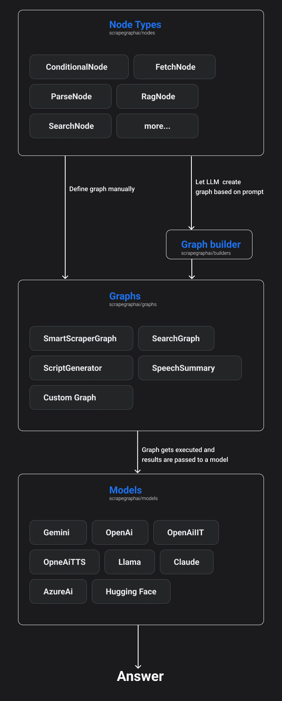
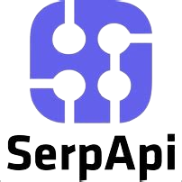
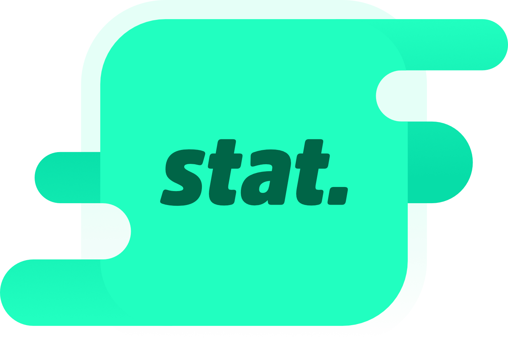

Overview 
========

ScrapeGraphAI is an **open-source** Python library designed to revolutionize **scraping** tools.
In today's data-intensive digital landscape, this library stands out by integrating **Large Language Models** (LLMs) 
and modular **graph-based** pipelines to automate the scraping of data from various sources (e.g., websites, local files etc.).

Simply specify the information you need to extract, and ScrapeGraphAI handles the rest, providing a more **flexible** and **low-maintenance** solution compared to traditional scraping tools.

Why ScrapegraphAI?
==================

Traditional web scraping tools often rely on fixed patterns or manual configuration to extract data from web pages.
ScrapegraphAI, leveraging the power of LLMs, adapts to changes in website structures, reducing the need for constant developer intervention. 
This flexibility ensures that scrapers remain functional even when website layouts change.

We support many LLMs including **GPT, Gemini, Groq, Azure, Hugging Face** etc.
as well as local models which can run on your machine using **Ollama**.

AI Models and Token Limits
==========================

ScrapGraphAI supports a wide range of AI models from various providers. Each model has a specific token limit, which is important to consider when designing your scraping pipelines. Here's an overview of the supported models and their token limits:

OpenAI Models
-------------
- GPT-3.5 Turbo (16,385 tokens)
- GPT-4 (8,192 tokens)
- GPT-4 Turbo Preview (128,000 tokens)

Azure OpenAI Models
-------------------
- GPT-3.5 Turbo (16,385 tokens)
- GPT-4 (8,192 tokens)
- GPT-4 Turbo Preview (128,000 tokens)

Google AI Models
----------------
- Gemini Pro (128,000 tokens)
- Gemini 1.5 Pro (128,000 tokens)

Anthropic Models
----------------
- Claude Instant (100,000 tokens)
- Claude 2 (200,000 tokens)
- Claude 3 (200,000 tokens)

Mistral AI Models
-----------------
- Mistral Large (128,000 tokens)
- Open Mistral 7B (32,000 tokens)
- Open Mixtral 8x7B (32,000 tokens)

For a complete list of supported models and their token limits, please refer to the API documentation.

Understanding token limits is crucial for optimizing your scraping tasks. Larger token limits allow for processing more text in a single API call, which can be beneficial for scraping lengthy web pages or documents.

Library Diagram
===============

With ScrapegraphAI you can use many already implemented scraping pipelines or create your own.

The diagram below illustrates the high-level architecture of ScrapeGraphAI:

FAQ
===

1. **What is ScrapeGraphAI?**

   ScrapeGraphAI is an open-source python library that uses large language models (LLMs) and graph logic to automate the creation of scraping pipelines for websites and various document types.

2. **How does ScrapeGraphAI differ from traditional scraping tools?**

   Traditional scraping tools rely on fixed patterns and manual configurations, whereas ScrapeGraphAI adapts to website structure changes using LLMs, reducing the need for constant developer intervention.

3. **Which LLMs are supported by ScrapeGraphAI?**

   ScrapeGraphAI supports several LLMs, including GPT, Gemini, Groq, Azure, Hugging Face, and local models that can run on your machine using Ollama.

4. **Can ScrapeGraphAI handle different document formats?**

   Yes, ScrapeGraphAI can scrape information from various document formats such as XML, HTML, JSON, and more.

5. **I get an empty or incorrect output when scraping a website. What should I do?**

   There are several reasons behind this issue, but for most cases, you can try the following:

      - Set the `headless` parameter to `False` in the graph_config. Some javascript-heavy websites might require it.

      - Check your internet connection. Low speed or unstable connection can cause the HTML to not load properly.

      - Try using a proxy server to mask your IP address. Check out the :ref:`Proxy` section for more information on how to configure proxy settings.
      
      - Use a different LLM model. Some models might perform better on certain websites than others.

      - Set the `verbose` parameter to `True` in the graph_config to see more detailed logs.

      - Visualize the pipeline graphically using :ref:`Burr`.
   
   If the issue persists, please report it on the GitHub repository.

6. **How does ScrapeGraphAI handle the context window limit of LLMs?**

   By splitting big websites/documents into chunks with overlaps and applying compression techniques to reduce the number of tokens. If multiple chunks are present, we will have multiple answers to the user prompt, and therefore, we merge them together in the last step of the scraping pipeline.

7. **How can I contribute to ScrapeGraphAI?**

   You can contribute to ScrapeGraphAI by submitting bug reports, feature requests, or pull requests on the GitHub repository. Join our `Discord <https://discord.gg/uJN7TYcpNa>`_ community and follow us on social media!

Sponsors
========

