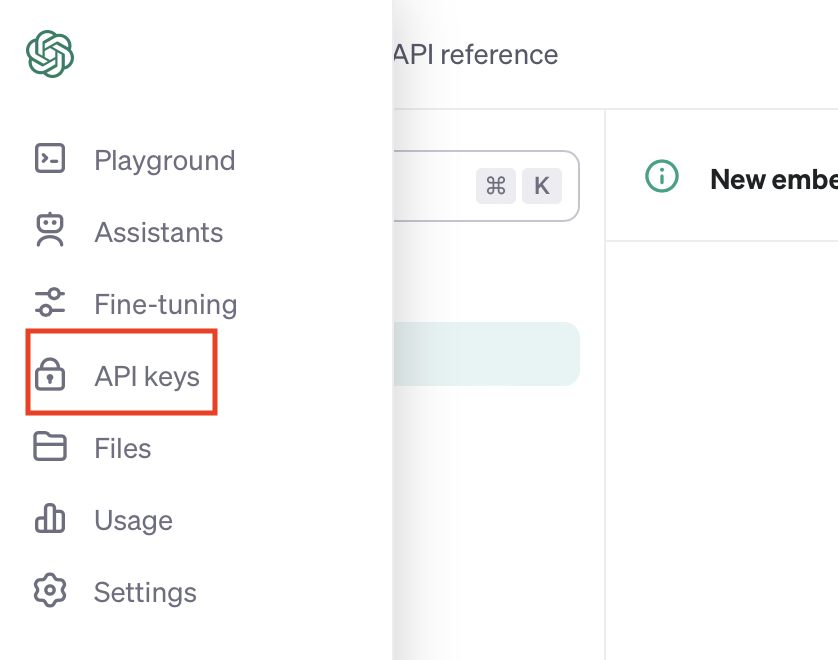

Overview
========

This is an open source project aimed at developing a scraping library using LLM through Langchain.
The goal is to be able to scrape data using natural language queries and store them in a structured format.

