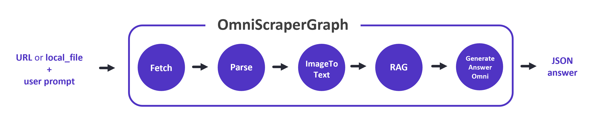
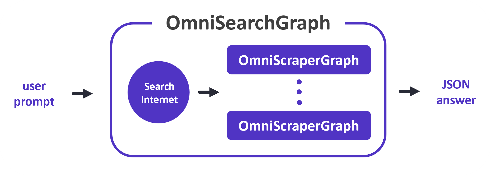
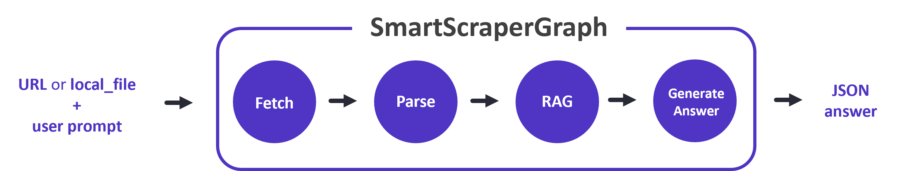
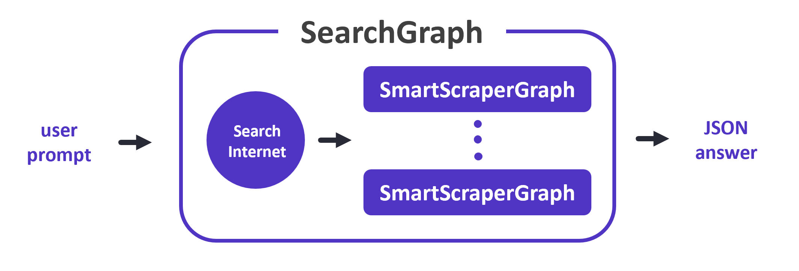
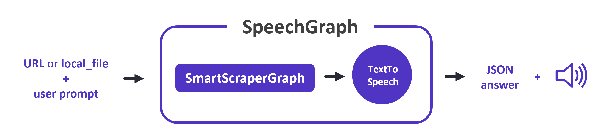

Graphs
======

Graphs are scraping pipelines aimed at solving specific tasks. They are composed by nodes which can be configured individually to address different aspects of the task (fetching data, extracting information, etc.).

There are several types of graphs available in the library, each with its own purpose and functionality. The most common ones are:

- **SmartScraperGraph**: one-page scraper that requires a user-defined prompt and a URL (or local file) to extract information using LLM.
- **SmartScraperMultiGraph**: multi-page scraper that requires a user-defined prompt and a list of URLs (or local files) to extract information using LLM. It is built on top of SmartScraperGraph.
- **SearchGraph**: multi-page scraper that only requires a user-defined prompt to extract information from a search engine using LLM. It is built on top of SmartScraperGraph.
- **SpeechGraph**: text-to-speech pipeline that generates an answer as well as a requested audio file. It is built on top of SmartScraperGraph and requires a user-defined prompt and a URL (or local file).
- **ScriptCreatorGraph**: script generator that creates a Python script to scrape a website using the specified library (e.g. BeautifulSoup). It requires a user-defined prompt and a URL (or local file).

With the introduction of `GPT-4o`, two new powerful graphs have been created:

- **OmniScraperGraph**: similar to `SmartScraperGraph`, but with the ability to scrape images and describe them.
- **OmniSearchGraph**: similar to `SearchGraph`, but with the ability to scrape images and describe them.

.. note::

   They all use a graph configuration to set up LLM models and other parameters. To find out more about the configurations, check the :ref:`LLM` and :ref:`Configuration` sections.

.. note::

   We can pass an optional `schema` parameter to the graph constructor to specify the output schema. If not provided or set to `None`, the schema will be generated by the LLM itself.

OmniScraperGraph
^^^^^^^^^^^^^^^^

|

First we define the graph configuration, which includes the LLM model and other parameters. Then we create an instance of the OmniScraperGraph class, passing the prompt, source, and configuration as arguments. Finally, we run the graph and print the result.
It will fetch the data from the source and extract the information based on the prompt in JSON format.

.. code-block:: python

   from scrapegraphai.graphs import OmniScraperGraph

   graph_config = {
      "llm": {...},
   }

   omni_scraper_graph = OmniScraperGraph(
      prompt="List me all the projects with their titles and image links and descriptions.",
      source="https://perinim.github.io/projects",
      config=graph_config,
      schema=schema
   )

   result = omni_scraper_graph.run()
   print(result)

OmniSearchGraph
^^^^^^^^^^^^^^^

|

Similar to OmniScraperGraph, we define the graph configuration, create multiple of the OmniSearchGraph class, and run the graph.
It will create a search query, fetch the first n results from the search engine, run n OmniScraperGraph instances, and return the results in JSON format.

.. code-block:: python

   from scrapegraphai.graphs import OmniSearchGraph

   graph_config = {
      "llm": {...},
   }

   # Create the OmniSearchGraph instance
   omni_search_graph = OmniSearchGraph(
      prompt="List me all Chioggia's famous dishes and describe their pictures.",
      config=graph_config,
      schema=schema
   )

   # Run the graph
   result = omni_search_graph.run()
   print(result)

SmartScraperGraph & SmartScraperMultiGraph
^^^^^^^^^^^^^^^^^^^^^^^^^^^^^^^^^^^^^^^^^^

|

First we define the graph configuration, which includes the LLM model and other parameters. Then we create an instance of the SmartScraperGraph class, passing the prompt, source, and configuration as arguments. Finally, we run the graph and print the result.
It will fetch the data from the source and extract the information based on the prompt in JSON format.

.. code-block:: python

   from scrapegraphai.graphs import SmartScraperGraph

   graph_config = {
      "llm": {...},
   }

   smart_scraper_graph = SmartScraperGraph(
      prompt="List me all the projects with their descriptions",
      source="https://perinim.github.io/projects",
      config=graph_config,
      schema=schema
   )

   result = smart_scraper_graph.run()
   print(result)

**SmartScraperMultiGraph** is similar to SmartScraperGraph, but it can handle multiple sources. We define the graph configuration, create an instance of the SmartScraperMultiGraph class, and run the graph.

SearchGraph
^^^^^^^^^^^

|

Similar to SmartScraperGraph, we define the graph configuration, create an instance of the SearchGraph class, and run the graph.
It will create a search query, fetch the first n results from the search engine, run n SmartScraperGraph instances, and return the results in JSON format.

.. code-block:: python

   from scrapegraphai.graphs import SearchGraph

   graph_config = {
      "llm": {...},
      "embeddings": {...},
   }

   # Create the SearchGraph instance
   search_graph = SearchGraph(
      prompt="List me all the traditional recipes from Chioggia",
      config=graph_config,
      schema=schema
   )

   # Run the graph
   result = search_graph.run()
   print(result)

SpeechGraph
^^^^^^^^^^^

|

Similar to SmartScraperGraph, we define the graph configuration, create an instance of the SpeechGraph class, and run the graph.
It will fetch the data from the source, extract the information based on the prompt, and generate an audio file with the answer, as well as the answer itself, in JSON format.

.. code-block:: python

   from scrapegraphai.graphs import SpeechGraph

   graph_config = {
      "llm": {...},
      "tts_model": {...},
   }

   # ************************************************
   # Create the SpeechGraph instance and run it
   # ************************************************

   speech_graph = SpeechGraph(
      prompt="Make a detailed audio summary of the projects.",
      source="https://perinim.github.io/projects/",
      config=graph_config,
      schema=schema
   )

   result = speech_graph.run()
   print(result)